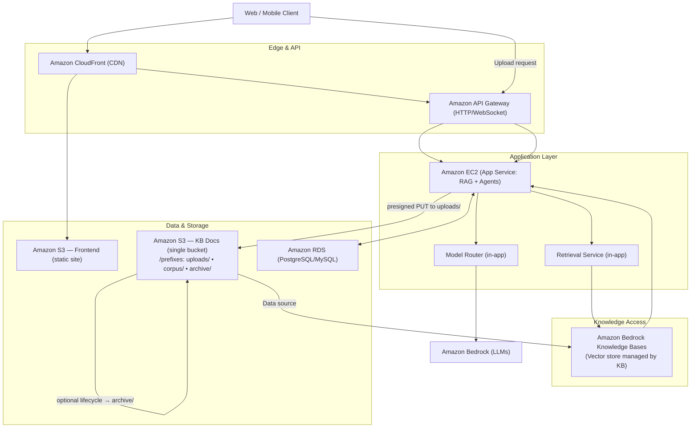
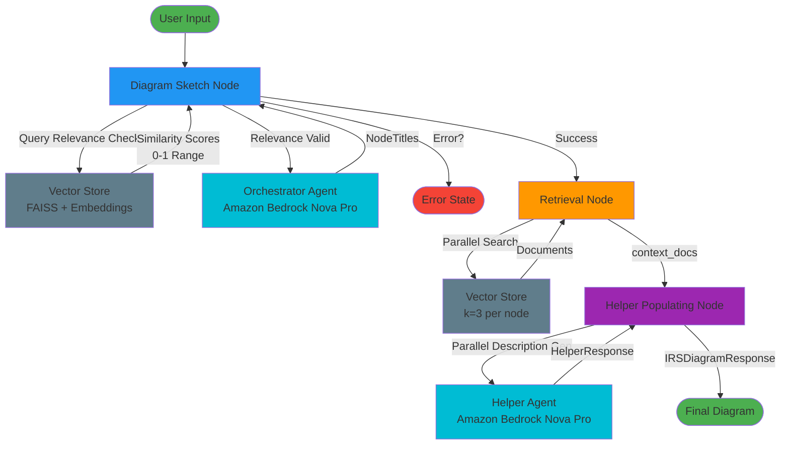
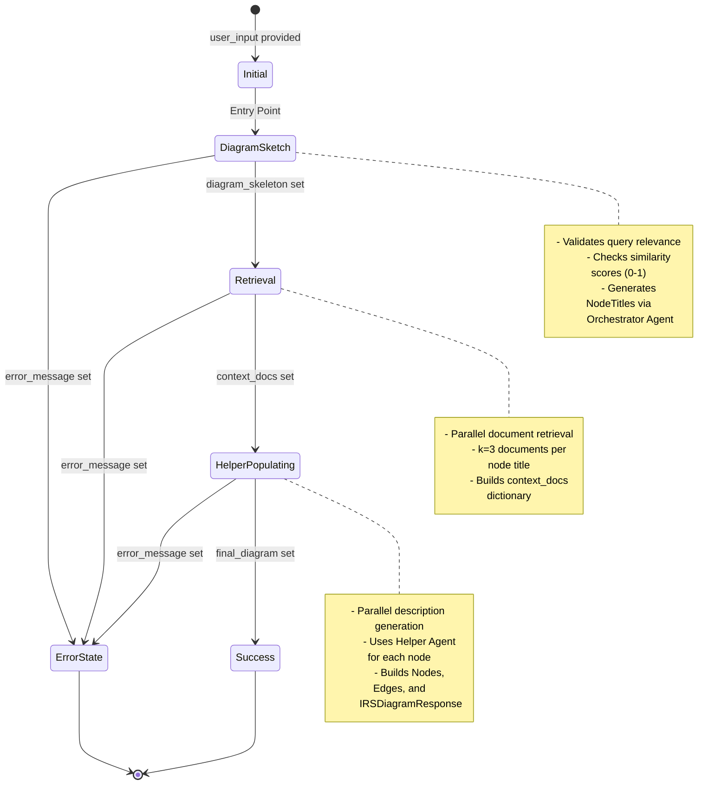
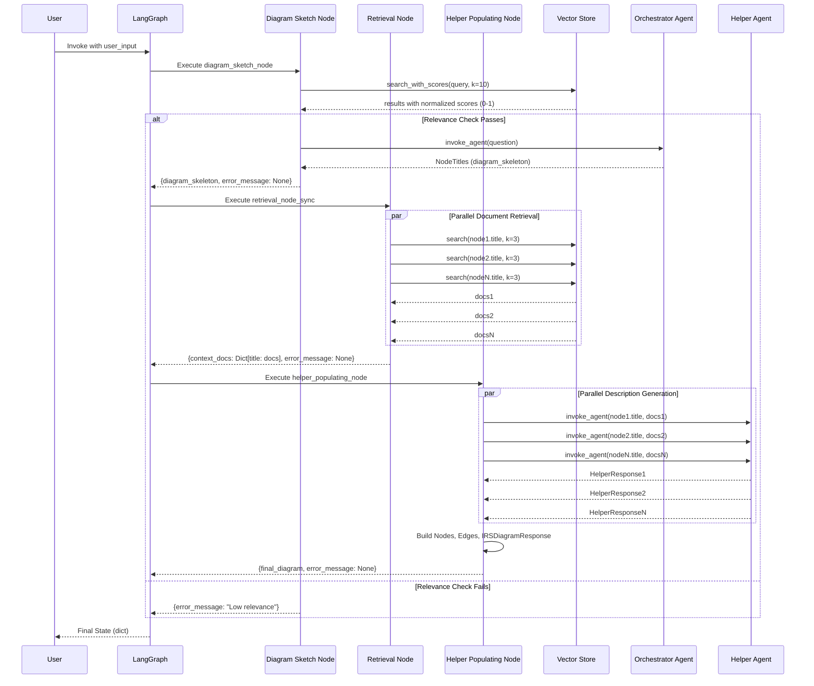
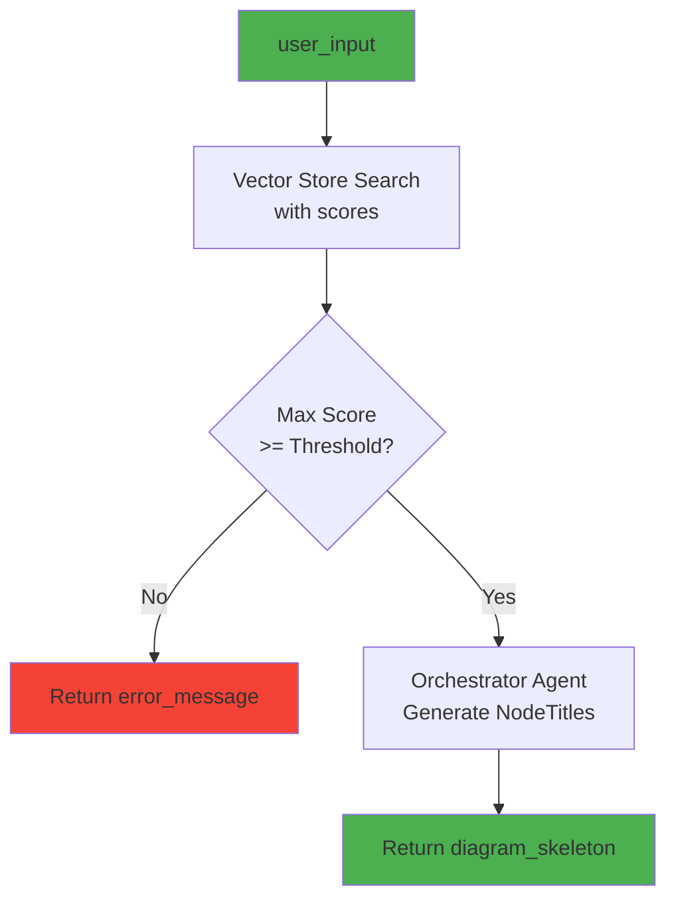
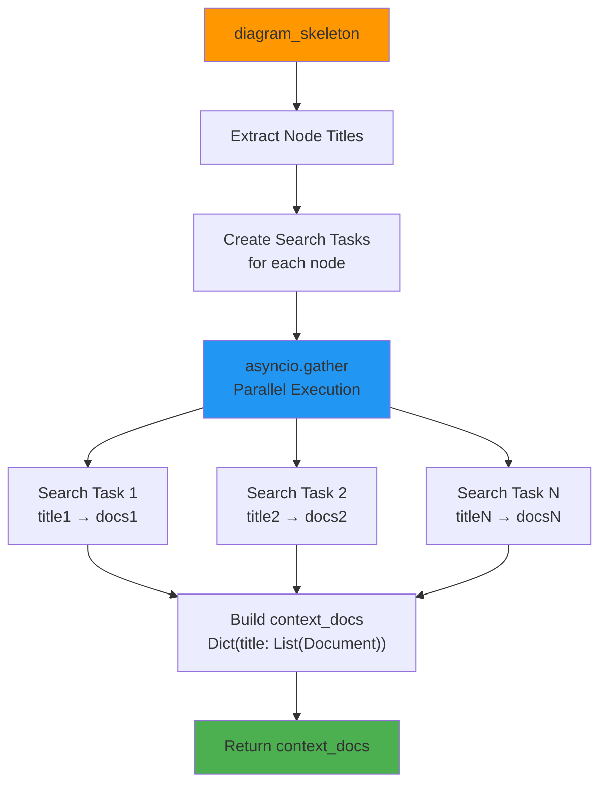
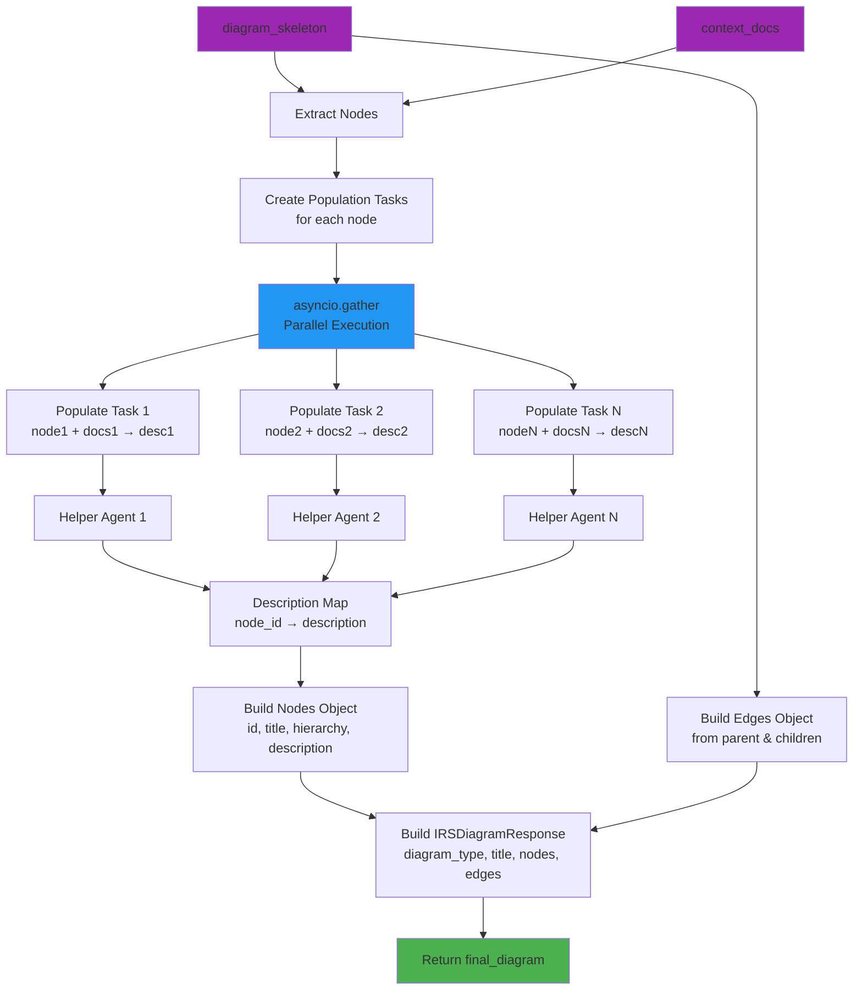
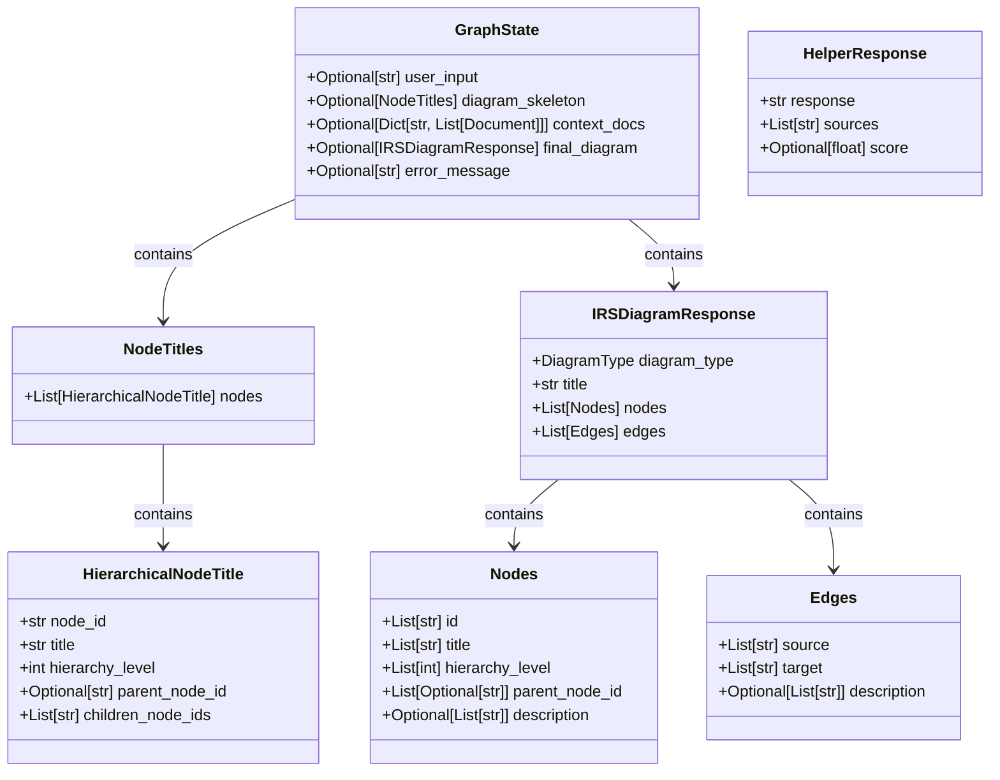
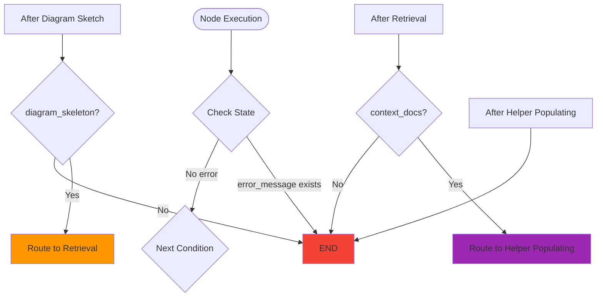

# Diagram Maker - Production-Ready AWS Deployment

A production-ready application demonstrating **deployable code architecture** with comprehensive AWS infrastructure considerations. This project emphasizes infrastructure as code, deployment patterns, and cloud-native design principles over AI capabilities.

## Core Philosophy

**The main idea of this project is not the AI—it's about building deployable code with deployment to AWS considerations.** Every component is designed with production deployment, scalability, and maintainability in mind.

## Architecture & Infrastructure

### High-Level Infrastructure

The system follows a cloud-native architecture designed for AWS deployment:

- **Edge Layer**: CloudFront CDN and API Gateway for request routing
- **Application Layer**: EC2-based services with RAG and agentic capabilities
- **Data Layer**: S3 buckets for frontend hosting and knowledge base storage
- **Database**: RDS (PostgreSQL/MySQL) for application data
- **Knowledge Access**: Amazon Bedrock Knowledge Bases for vector search

#### High-Level Architecture Diagram



### Infrastructure as Code

All AWS resources are defined using **Terraform modules** following best practices:

- **Modular Design**: Reusable Terraform modules for each infrastructure component
- **Environment-Aware**: Supports multiple environments (dev, staging, prod) via variables
- **Resource Configuration**: Each AWS resource properly configured with versioning, encryption, lifecycle rules, and access controls

**Terraform Workflow Documentation**: [`Docs/terraform_mmd/terraform_workflow.md`](Docs/terraform_mmd/terraform_workflow.md)

### S3 Bucket Architecture

The project implements a **two-bucket strategy**:

- **Frontend Bucket**: Static website hosting with CloudFront integration
- **Knowledge Base Bucket**: Document storage with prefix-based organization:
  - `uploads/` - Initial document uploads
  - `corpus/` - Processed documents ready for indexing
  - `archive/` - Lifecycle-managed archived documents

Both buckets include:
- Server-side encryption (SSE)
- Versioning
- Lifecycle policies
- Proper IAM access controls

## Code Architecture Patterns

### Singleton Pattern for Vector Store

The vector store implementation uses a **singleton pattern with lazy initialization** to balance global access with testability:

**Documentation**: [`Docs/vector_store_singleton_pattern.md`](Docs/vector_store_singleton_pattern.md)

Key benefits:
- Single instance ensures consistency across the application
- Lazy initialization reduces startup overhead
- Testable through explicit reset functions
- Flexible for custom configurations when needed

```python
from src.core.pipeline.vector_store import vector_store

# Direct usage - singleton instance
results = await vector_store.search("query", k=10)
```

## Agentic System Architecture

The diagram generation system is built using **LangGraph**, a framework for building stateful, multi-agent applications. The system orchestrates three main nodes that work together to transform user queries into structured diagrams.

### LangGraph Workflow Overview



### Node Architecture and Data Flow

```mermaid
flowchart LR
    subgraph GraphState["GraphState (Pydantic BaseModel)"]
        UserInput[user_input: str]
        DiagramSkeleton[diagram_skeleton: NodeTitles]
        ContextDocs["context_docs: Dict(str, List(Document))"]
        FinalDiagram[final_diagram: IRSDiagramResponse]
        ErrorMsg[error_message: str]
    end

    subgraph Node1["1. Diagram Sketch Node"]
        RelevanceCheck[Relevance Check<br/>Max Score vs Threshold]
        OrchestratorCall[Invoke Orchestrator Agent]
        NodeTitlesOut[Output: NodeTitles]
    end

    subgraph Node2["2. Retrieval Node"]
        ParallelSearch[Parallel Search<br/>asyncio.gather]
        SearchTask1[Search Task 1<br/>title → docs]
        SearchTask2[Search Task 2<br/>title → docs]
        SearchTaskN[Search Task N<br/>title → docs]
        ContextDict["Build context_docs<br/>Dict(title: List(Document))"]
    end

    subgraph Node3["3. Helper Populating Node"]
        ParallelPopulate[Parallel Population<br/>asyncio.gather]
        PopulateTask1[Populate Task 1<br/>node + docs → description]
        PopulateTask2[Populate Task 2<br/>node + docs → description]
        PopulateTaskN[Populate Task N<br/>node + docs → description]
        BuildNodes[Build Nodes Object<br/>id, title, hierarchy, description]
        BuildEdges[Build Edges Object<br/>from parent & children]
        BuildDiagram[Build IRSDiagramResponse]
    end

    UserInput --> Node1
    Node1 --> RelevanceCheck
    RelevanceCheck -->|Pass| OrchestratorCall
    OrchestratorCall --> NodeTitlesOut
    NodeTitlesOut --> DiagramSkeleton

    DiagramSkeleton --> Node2
    Node2 --> ParallelSearch
    ParallelSearch --> SearchTask1
    ParallelSearch --> SearchTask2
    ParallelSearch --> SearchTaskN
    SearchTask1 --> ContextDict
    SearchTask2 --> ContextDict
    SearchTaskN --> ContextDict
    ContextDict --> ContextDocs

    DiagramSkeleton --> Node3
    ContextDocs --> Node3
    Node3 --> ParallelPopulate
    ParallelPopulate --> PopulateTask1
    ParallelPopulate --> PopulateTask2
    ParallelPopulate --> PopulateTaskN
    PopulateTask1 --> BuildNodes
    PopulateTask2 --> BuildNodes
    PopulateTaskN --> BuildNodes
    DiagramSkeleton --> BuildEdges
    BuildNodes --> BuildDiagram
    BuildEdges --> BuildDiagram
    BuildDiagram --> FinalDiagram

    style GraphState fill:#E3F2FD
    style Node1 fill:#BBDEFB
    style Node2 fill:#FFE0B2
    style Node3 fill:#E1BEE7
```



### State Transition Diagram



### Parallel Execution Patterns



### Node Details

#### 1. Diagram Sketch Node

**Purpose**: Validates query relevance and generates the initial diagram skeleton.

**Key Features**:
- **Relevance Validation**: Checks similarity scores (normalized to 0-1 range) against threshold
- **Orchestrator Agent**: Uses Amazon Bedrock Nova Pro to generate hierarchical node structure
- **Error Handling**: Returns error if query is not relevant or skeleton generation fails

**Input**: `user_input: str`
**Output**: `diagram_skeleton: NodeTitles` or `error_message: str`



#### 2. Retrieval Node

**Purpose**: Retrieves relevant documents for each node title in parallel.

**Key Features**:
- **Parallel Execution**: Uses `asyncio.gather` for concurrent searches
- **Top-K Retrieval**: Retrieves k=3 documents per node title
- **Context Mapping**: Maps each node title to its retrieved documents

**Input**: `diagram_skeleton: NodeTitles`
**Output**: `context_docs: Dict[str, List[Document]]` or `error_message: str`



#### 3. Helper Populating Node

**Purpose**: Generates descriptions for all nodes and constructs the final diagram.

**Key Features**:
- **Parallel Description Generation**: Uses thread pool executor for true parallelism
- **Helper Agent Integration**: Calls helper agent for each node with its context documents
- **Diagram Construction**: Builds `Nodes`, `Edges`, and `IRSDiagramResponse` objects
- **Edge Building**: Creates edges from both `parent_node_id` and `children_node_ids` relationships

**Input**: `diagram_skeleton: NodeTitles`, `context_docs: Dict[str, List[Document]]`, `user_input: str`
**Output**: `final_diagram: IRSDiagramResponse` or `error_message: str`



### Data Models



### Routing Logic



### Key Implementation Details

1. **State Management**: LangGraph outputs dictionaries even when initialized with Pydantic BaseModel. All nodes handle both dict and object access patterns.

2. **Parallel Execution**:
   - Retrieval node uses `asyncio.gather` for parallel document searches
   - Helper populating node uses `loop.run_in_executor` for parallel agent calls

3. **Error Handling**: Each node returns `error_message` in state, and routing functions check for errors before proceeding.

4. **Agent Response Extraction**: Both orchestrator and helper agents extract `structured_response` from the agent's dictionary output (which contains both `messages` and `structured_response`).

5. **Similarity Score Normalization**: FAISS distance scores are normalized to 0-1 similarity range using `1.0 / (1.0 + distance)`.

## Project Structure

```
diagram_maker/
├── terraform/              # Infrastructure as Code
│   ├── modules/           # Reusable Terraform modules
│   │   ├── s3_frontend/  # Frontend hosting module
│   │   ├── s3_kb/        # Knowledge base storage module
│   │   └── ...
│   ├── main.tf           # Root module definitions
│   └── variables.tf      # Environment variables
├── src/                   # Application code
│   ├── api/              # FastAPI endpoints
│   ├── boundary/         # Data access layer
│   ├── core/             # Business logic
│   ├── services/         # Service layer
│   └── configs/          # Configuration management
├── Docs/                  # Architecture and deployment documentation
│   ├── arch_mmd/         # Architecture diagrams
│   ├── terraform_mmd/    # Terraform workflow diagrams
│   └── vector_store_singleton_pattern.md
└── tests/                 # Comprehensive test suite
```

## Deployment Considerations

### Environment Configuration

- **Multi-Environment Support**: Terraform variables enable deployment to dev, staging, and production
- **Configuration Management**: Centralized configs with environment-specific overrides
- **Secrets Management**: AWS Secrets Manager integration ready

### Scalability

- **Stateless Application Design**: Enables horizontal scaling
- **S3 Lifecycle Policies**: Automatic archival and expiration
- **Database Connection Pooling**: Optimized for concurrent requests
- **CDN Integration**: CloudFront for global content delivery

### Security

- **IAM Roles**: Least-privilege access patterns
- **Encryption**: At-rest and in-transit encryption
- **VPC Endpoints**: Private network access to AWS services
- **WAF Integration**: Web application firewall ready

### Observability

- **CloudWatch Integration**: Metrics and logging
- **X-Ray Tracing**: Distributed tracing support
- **Health Checks**: Application and infrastructure monitoring

## Getting Started

### Prerequisites

- Python 3.12+
- Terraform >= 1.0
- AWS CLI configured
- AWS account with appropriate permissions

### Local Development

```bash
# Install dependencies
uv sync

# Run application
python main.py

# Run tests
pytest
```

### Infrastructure Deployment

```bash
cd terraform

# Initialize Terraform
terraform init

# Plan deployment
terraform plan -var="environment=dev"

# Apply infrastructure
terraform apply -var="environment=dev"

# View outputs
terraform output
```

## Testing Strategy

- **Unit Tests**: Core business logic and utilities
- **Integration Tests**: Service integration and data pipeline
- **E2E Tests**: API endpoint validation
- **Benchmark Tests**: Performance and load testing

## Documentation

All deployment and architecture documentation is located in the [`Docs/`](Docs/) directory:

- **Architecture Diagrams**: Mermaid diagrams for infrastructure design
- **Terraform Workflows**: Step-by-step module creation and usage
- **Code Patterns**: Design patterns and best practices

## Key Design Principles

1. **Infrastructure as Code First**: All AWS resources defined in Terraform
2. **Modularity**: Reusable, composable modules
3. **Environment Parity**: Same code, different configurations
4. **Testability**: Code designed for easy testing and mocking
5. **Observability**: Built-in logging, metrics, and tracing
6. **Security by Default**: Encryption, IAM, and access controls
7. **Scalability**: Stateless design and horizontal scaling support


# diagram_maker
