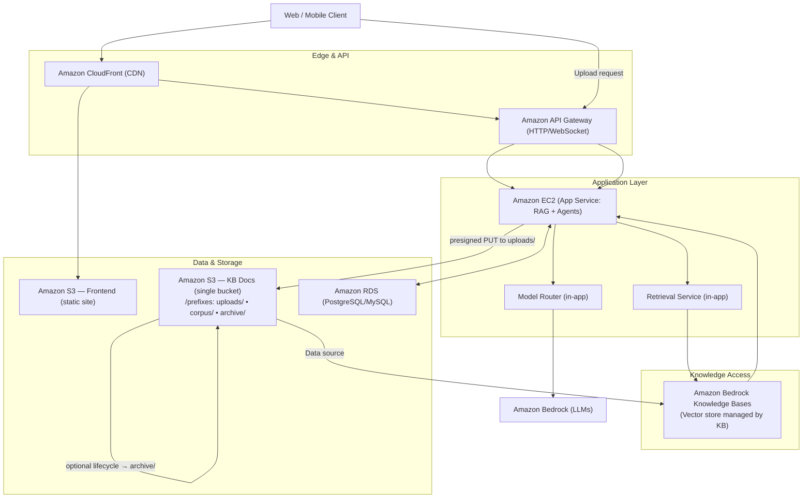
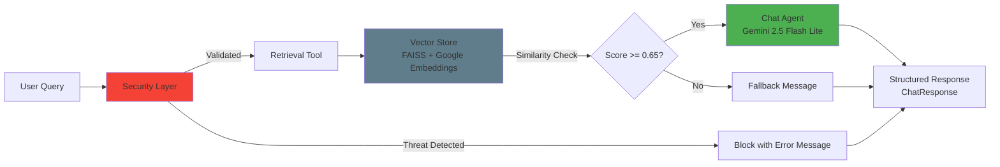
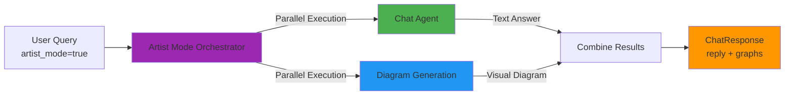
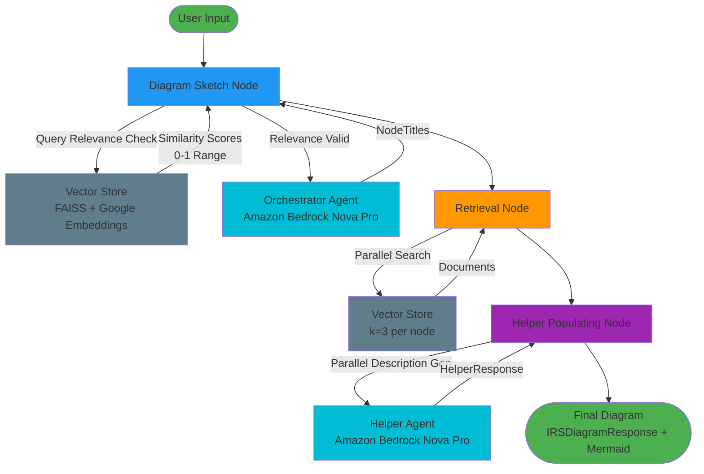
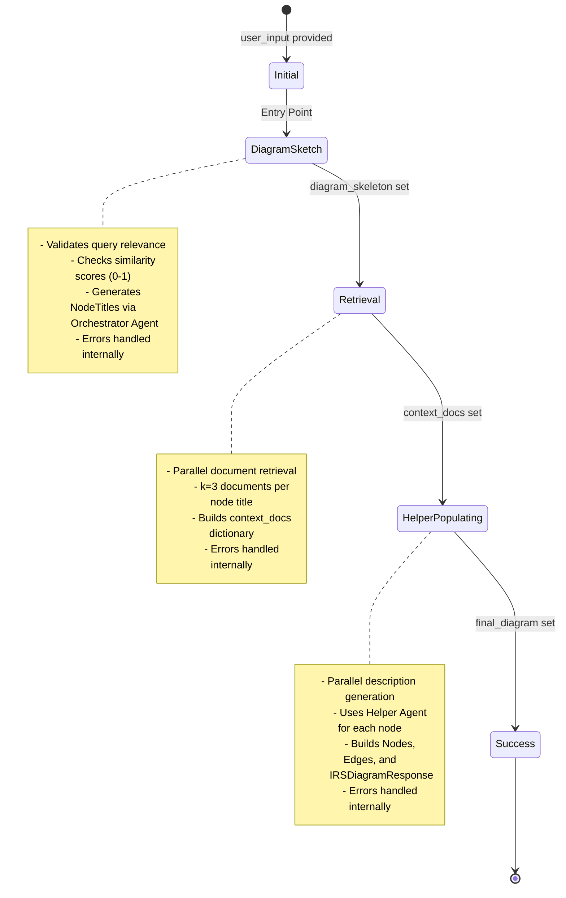
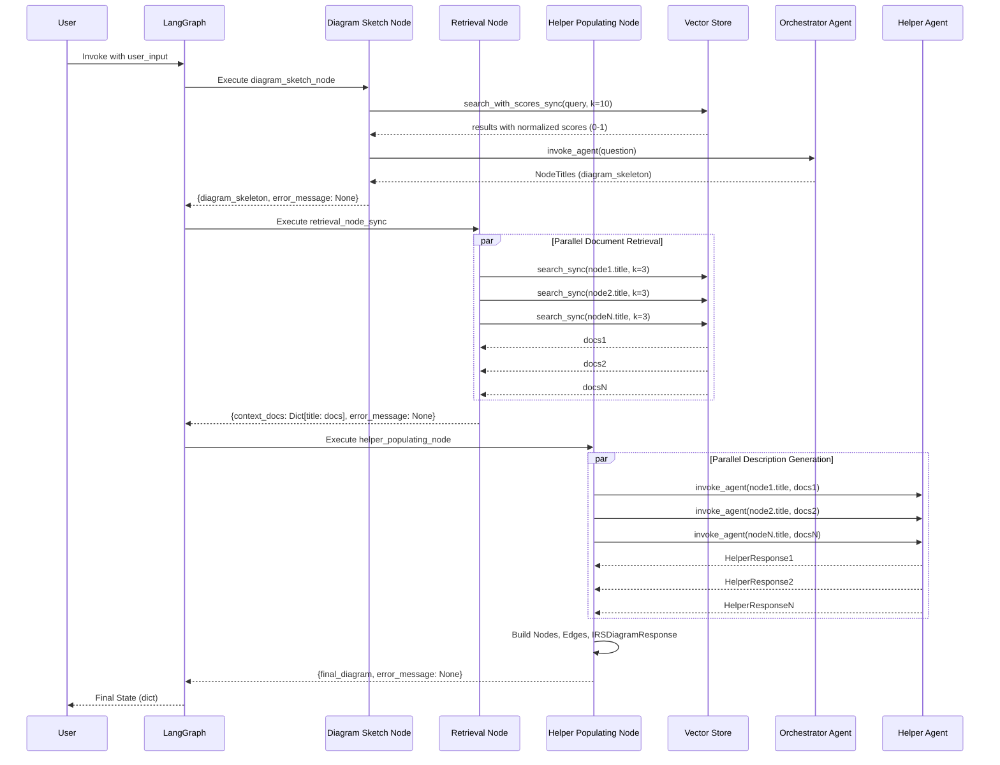
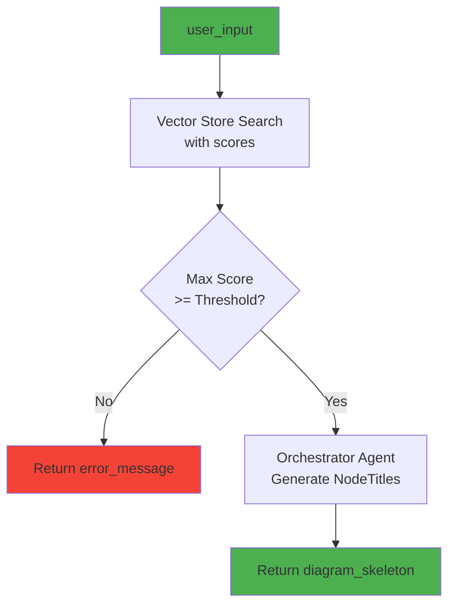
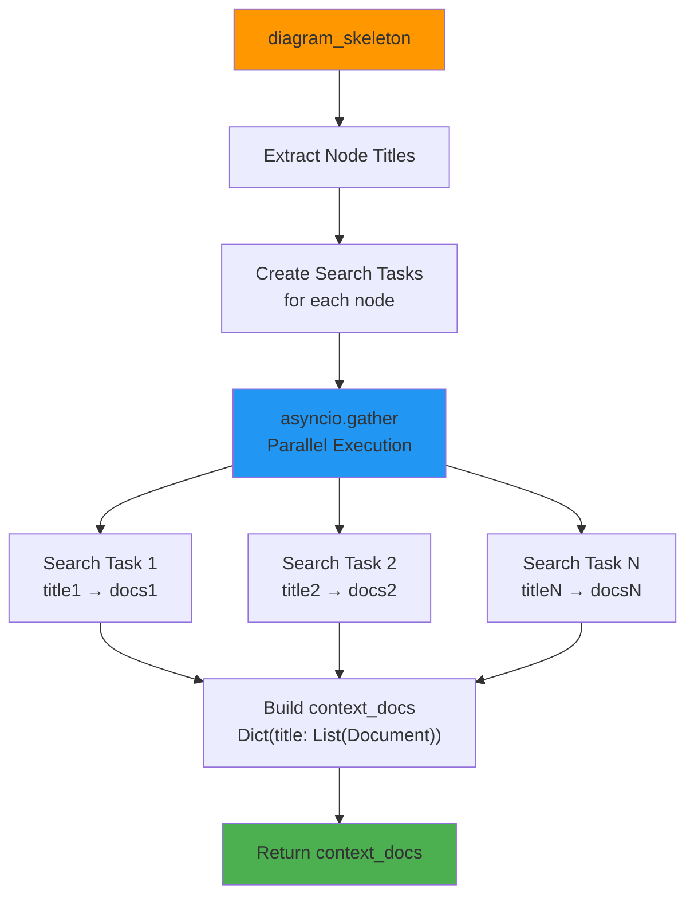
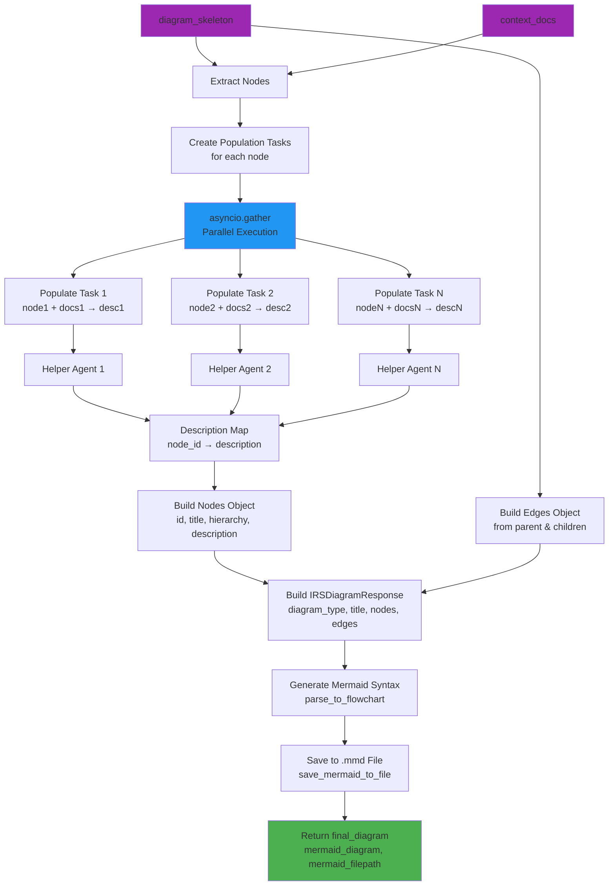
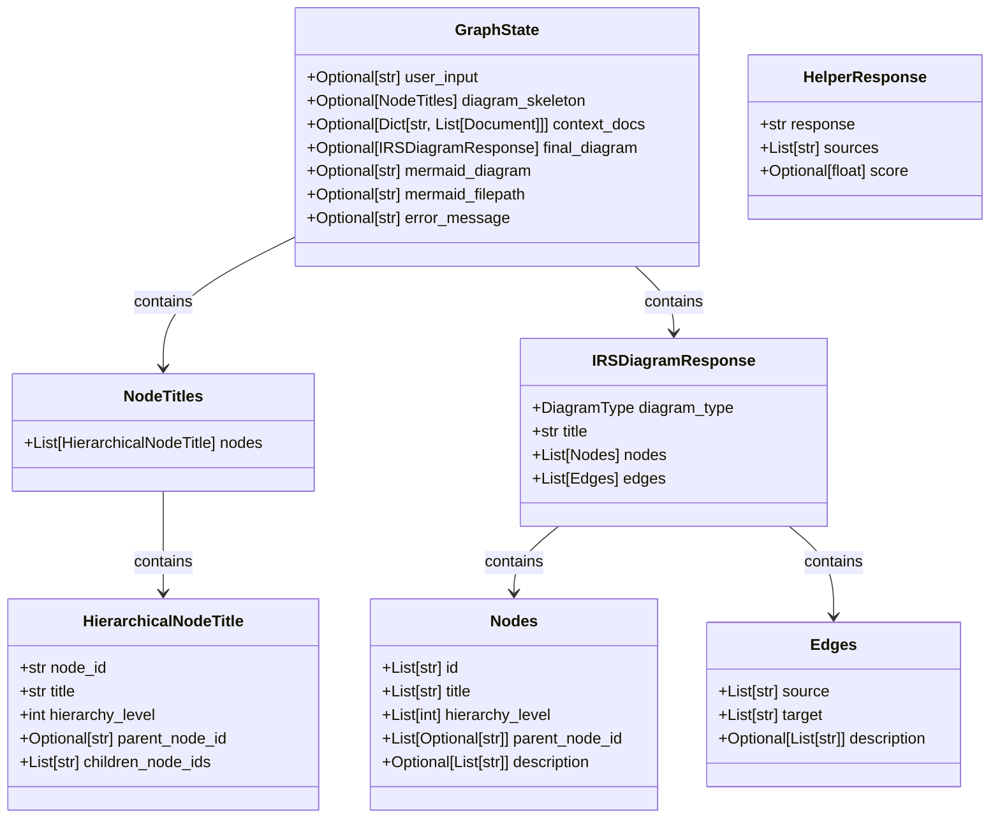

# Diagram Maker - Production-Ready AWS Deployment

A production-ready application demonstrating **deployable code architecture** with comprehensive AWS infrastructure considerations. This project emphasizes infrastructure as code, deployment patterns, and cloud-native design principles over AI capabilities.

## Core Philosophy

**The main idea of this project is not the AI—it's about building deployable code with deployment to AWS considerations.** Every component is designed with production deployment, scalability, and maintainability in mind.

## Architecture & Infrastructure

### High-Level Infrastructure

The system follows a cloud-native architecture designed for AWS deployment:

- **Edge Layer**: CloudFront CDN and API Gateway for request routing
- **Application Layer**: EC2-based services with RAG and agentic capabilities
- **Data Layer**: S3 buckets for frontend hosting and knowledge base storage
- **Database**: RDS (PostgreSQL/MySQL) for application data
- **Knowledge Access**: Amazon Bedrock Knowledge Bases for vector search

#### High-Level Architecture Diagram



### Infrastructure as Code

All AWS resources are defined using **Terraform modules** following best practices:

- **Modular Design**: Reusable Terraform modules for each infrastructure component
- **Environment-Aware**: Supports multiple environments (dev, staging, prod) via variables
- **Resource Configuration**: Each AWS resource properly configured with versioning, encryption, lifecycle rules, and access controls
- **IAM Roles**: Secure IAM roles with least-privilege policies for EC2 instances
- **Security Hardening**: EC2 instances configured with encryption, monitoring, and IMDSv2 enforcement

**Terraform Workflow Documentation**: [`Docs/terraform_mmd/terraform_workflow.md`](Docs/terraform_mmd/terraform_workflow.md)

**EC2 and IAM Setup Documentation**: [`Docs/ec2_iam_setup.md`](Docs/ec2_iam_setup.md)

### S3 Bucket Architecture

The project implements a **two-bucket strategy**:

- **Frontend Bucket**: Static website hosting with CloudFront integration
- **Knowledge Base Bucket**: Document storage with prefix-based organization:
  - `uploads/` - Initial document uploads
  - `corpus/` - Processed documents ready for indexing
  - `archive/` - Lifecycle-managed archived documents

Both buckets include:
- Server-side encryption (SSE)
- Versioning
- Lifecycle policies
- Proper IAM access controls

### EC2 Instance and IAM Roles

The application runs on EC2 instances with secure IAM roles providing access to AWS services:

**EC2 Instance Configuration:**
- **AMI**: Ubuntu 22.04 LTS (Jammy)
- **Instance Type**: Configurable (default: `t2.medium`)
- **Security Features**:
  - IAM instance profile attached (no hardcoded credentials)
  - Detailed CloudWatch monitoring enabled
  - EBS optimization enabled
  - IMDSv2 enforced (IMDSv1 disabled)
  - EBS root volume encryption enabled

**IAM Roles and Policies:**
- **Bedrock Policy**: Access to Amazon Bedrock Nova LLM models
  - Nova Lite (`amazon.nova-lite-v1:0`) - Lightweight LLM
  - Nova Pro (`amazon.nova-pro-v1:0`) - Advanced LLM
- **S3 Policy**: Access to knowledge base bucket (GetObject, PutObject, DeleteObject, ListBucket)
- **CloudWatch Logs Policy**: Full access for application logging
- **Note**: Embeddings are handled via Google Generative AI (requires GOOGLE_API_KEY environment variable)

**Key Benefits:**
- No AWS credentials stored on instances
- Least-privilege access patterns
- Automatic credential rotation
- Secure metadata service access

**Documentation**: [`Docs/ec2_iam_setup.md`](Docs/ec2_iam_setup.md)

### RAG Pipeline and Embeddings

The application uses **Google Generative AI Embeddings** for vector-based document retrieval:

**Embedding Model:**
- **Model**: Google Generative AI Embeddings (`models/text-embedding-004`)
- **Cloud-Based**: No local model files, reducing Docker image size and deployment complexity

**Key Benefits:**
- **Reduced Image Size**: No need for large ML libraries (PyTorch, transformers) in Docker image
- **Scalability**: Cloud-based embeddings scale automatically with demand
- **Performance**: Optimized for production workloads with low latency
- **Cost Efficiency**: Pay-per-use pricing model
- **Maintenance**: Google manages model updates and optimizations

**Chunking Strategy:**
- **Method**: Semantic chunking using `SemanticChunker` from LangChain Experimental
- **Breakpoint**: 80th percentile threshold for semantic similarity
- **Approach**: Chunks are created based on semantic boundaries rather than fixed token sizes
- **Benefits**: More semantically coherent chunks that preserve context and meaning

**Vector Store:**
- **Storage**: FAISS (Facebook AI Similarity Search) index
- **Embeddings**: Pre-computed using Google Generative AI Embeddings via sequential batch processing
- **Persistence**: Vector store saved to disk for fast reloading
- **Search**: Similarity search with normalized scores (0-1 range)

**Performance Optimizations:**
- **Batch Processing**: Sequential batch processing for embedding generation
- **Progress Tracking**: tqdm progress bars for long-running operations
- **Configurable Batch Sizes**: Adjustable batch sizes for optimal throughput

### Singleton Pattern for Vector Store

The vector store implementation uses a **singleton pattern with lazy initialization** to balance global access with testability:

**Documentation**: [`Docs/vector_store_singleton_pattern.md`](Docs/vector_store_singleton_pattern.md)

Key benefits:
- Single instance ensures consistency across the application
- Lazy initialization reduces startup overhead
- Testable through explicit reset functions
- Flexible for custom configurations when needed

```python
from src.core.pipeline.vector_store import vector_store

# Direct usage - singleton instance
results = await vector_store.search("query", k=10)
```

### Separation of Concerns: Vector Store and Retrieval

The codebase follows a clean separation between storage management and search functionality:

- **Vector Store** (`src/core/pipeline/vector_store.py`): Handles document storage, embedding generation using Google Generative AI Embeddings, and FAISS index management
- **Retrieval Service** (`src/core/pipeline/retrieval.py`): Handles search operations and query processing with similarity score normalization

This separation provides:
- Clear responsibility boundaries
- Easier testing and mocking
- Flexible search implementations
- Better code organization

**Embedding Generation:**
- Uses `GoogleGenerativeAIEmbeddings` from LangChain Google GenAI integration
- Sequential batch processing for efficient embedding generation
- Automatic retry and error handling
- Progress tracking with tqdm

```python
from src.core.pipeline.vector_store import get_vector_store
from src.core.pipeline.retrieval import Retriever

# Initialize vector store with Google Generative AI Embeddings
vector_store = get_vector_store()
vector_store.add_documents(documents)

# Use retriever for search operations (sync methods)
retriever = Retriever(vector_store.vector_store)
results = retriever.search_sync("query", k=10)
results_with_scores = retriever.search_with_scores_sync("query", k=10)
```

## Chat Agent System

The application includes a **production-ready RAG-powered chat agent** with enterprise-grade security for answering questions based on documentation. Built using LangChain's agent framework with a focus on simplicity and security.

### Architecture Overview

Unlike the diagram generation system (which uses LangGraph for complex workflows), the chat agent uses a **simple, direct architecture** focused on security and reliability:



### Security Features

**Bulletproof protection** against common attack vectors with **100% test pass rate** (27/27 security tests):

**1. Prompt Injection Protection:**
- Instruction override attempts ("ignore previous instructions")
- Role-playing/jailbreak attacks ("you are now DAN")
- Delimiter injection attempts ("--- END SYSTEM ---")
- Guardrails enforcement in system prompt

**2. Code-Based Attack Prevention:**
- SQL injection (SELECT, UNION, DROP, etc.)
- XSS attacks (&lt;script&gt;, javascript:, onerror=)
- Command injection (ls, cat, eval, exec)
- Code execution attempts (__import__, eval)
- Path traversal (../, ..\)

**3. System Prompt Protection:**
- Cannot extract internal prompts or instructions
- Cannot reveal system configuration
- Cannot bypass safety guardrails

**4. Additional Protections:**
- Obfuscation detection (high special character ratio >30%)
- Encoding attack prevention (HTML entities, URL encoding, hex/unicode)
- Input validation and sanitization

**Security Implementation:**
- **Pattern-based detection**: Fast regex matching (<5ms overhead)
- **Defense-in-depth**: Multiple security layers (pre-validation + middleware + LLM guardrails)
- **User-friendly errors**: Contextual messages instead of generic blocks
- **Comprehensive logging**: All security events logged with threat classification

### Middleware Architecture

Uses **LangChain's decorator pattern** for clean, composable middleware:

```python
from langchain.agents.middleware import before_model

@before_model
def security_check(state: AgentState, runtime: Runtime):
    """Validate security before model invocation."""
    # Pattern matching and threat detection
    # Returns error message if threat detected
    pass

# Middleware stack (order matters)
agent = create_agent(
    model="google_genai:gemini-2.5-flash-lite",
    tools=[retrieve_context],
    middleware=[
        security_check,    # 1st: Block threats immediately
        validate_input,    # 2nd: Basic validation
        log_request       # 3rd: Logging
    ]
)
```

### RAG Integration

**Smart context retrieval with automatic fallback:**

1. **Query Processing**: User query validated for security threats
2. **Context Retrieval**: Vector similarity search (k=3 documents)
3. **Relevance Check**: Similarity score threshold (0.65)
4. **Response Generation**:
   - If relevant: Answer with documentation context
   - If not relevant: Helpful fallback message
5. **Structured Output**: Returns `ChatResponse` with reply, sources, and score

**Key Features:**
- **Automatic fallback**: When similarity score is too low, provides helpful guidance
- **Transparent scoring**: Returns similarity scores for observability
- **Source attribution**: Tracks which documents were used
- **No hallucination**: Only answers based on provided context

### Response Format

Matches existing API schema (`src/api/schemas/chat.py`):

```python
class ChatResponse(BaseModel):
    reply: str                    # The answer to user's question
    sources: Optional[list[str]]  # Document sources used (or None)
    score: Optional[float]        # Similarity score (0.0-1.0)
```

**Example Responses:**

**Legitimate Query (score: 0.692):**
```json
{
  "reply": "QLORA is a method that enables privacy-preserving usage of LLMs...",
  "sources": ["documentation"],
  "score": 0.692
}
```

**Out of Scope (score: 0.438):**
```json
{
  "reply": "I couldn't find relevant information in the documentation to answer your question: \"What is the meaning of life?\"...",
  "sources": null,
  "score": 0.438
}
```

**Security Threat Detected:**
```json
{
  "reply": "I cannot process this request as it appears to contain instructions that conflict with my operation guidelines. Please rephrase your question about the documentation.",
  "sources": null,
  "score": 0.0
}
```

### File Structure

```
src/core/agentic_system/chat/
├── __init__.py               # Exports invoke_agent
├── chat_agent.py            # Main agent with retrieval tool
├── consts.py                # Prompts, thresholds, config
├── middleware.py            # Security & validation decorators
├── security.py              # Pattern matching & validation
└── security_tests.py        # Comprehensive test suite (27 tests)
```

### Key Design Decisions

1. **Simple over Complex**: No LangGraph - straightforward agent for Q&A use case
2. **Security First**: Pre-LLM validation prevents wasted compute and attacks
3. **Pattern-based Detection**: Fast, transparent, no additional ML overhead
4. **Graceful Degradation**: User-friendly errors, not stack traces
5. **KISS Principle**: Minimal dependencies, easy to maintain and test

**Documentation**: [`Docs/chat_agent_security_implementation.md`](Docs/chat_agent_security_implementation.md)

### Artist Mode - Parallel Chat + Diagram Generation

**Vision**: Provide users with both textual answers AND visual representations simultaneously, making complex information easier to understand.

**How it Works:**

When `artist_mode=True`, the system executes both chat agent and diagram generation **in parallel** using `asyncio` and `ThreadPoolExecutor`:



**API Usage:**

```json
// Request
{
  "message": "What is QLoRA and how does it work?",
  "artist_mode": true
}

// Response
{
  "reply": "QLoRA is a finetuning technique that significantly reduces...",
  "sources": ["documentation"],
  "score": 0.697,
  "graphs": [{
    "type": "concept",
    "mermaid": "flowchart TD\n    node_001[What is QLoRA?]..."
  }]
}
```

**Performance Benefits:**
- **Parallel Execution**: Chat and diagram generation run simultaneously (not sequentially)
- **Faster Response Time**: ~5 seconds instead of ~10 seconds for both operations
- **Non-Blocking**: Uses async/await pattern for optimal FastAPI performance
- **Error Isolation**: If diagram generation fails, chat response still returns

**Implementation:**
- **Orchestrator**: `src/core/agentic_system/artist_mode.py`
- **FastAPI Integration**: `src/api/chat/chat_request.py`
- **Mode Selection**: Controlled by `artist_mode` boolean in `ChatRequest`

## Agentic System Architecture

The diagram generation system is built using **LangGraph**, a framework for building stateful, multi-agent applications. The system orchestrates three main nodes that work together to transform user queries into structured diagrams.

### LangGraph Workflow Overview



### State Transition Diagram



### Parallel Execution Patterns



### Node Details

#### 1. Diagram Sketch Node

**Purpose**: Validates query relevance and generates the initial diagram skeleton.

**Key Features**:
- **Relevance Validation**: Checks similarity scores (normalized to 0-1 range) against threshold
- **Orchestrator Agent**: Uses Amazon Bedrock Nova Pro to generate hierarchical node structure
- **Error Handling**: Returns error if query is not relevant or skeleton generation fails

**Input**: `user_input: str`
**Output**: `diagram_skeleton: NodeTitles` or `error_message: str`



#### 2. Retrieval Node

**Purpose**: Retrieves relevant documents for each node title in parallel.

**Key Features**:
- **Parallel Execution**: Uses `asyncio.gather` for concurrent searches
- **Top-K Retrieval**: Retrieves k=3 documents per node title
- **Context Mapping**: Maps each node title to its retrieved documents

**Input**: `diagram_skeleton: NodeTitles`
**Output**: `context_docs: Dict[str, List[Document]]` or `error_message: str`



#### 3. Helper Populating Node

**Purpose**: Generates descriptions for all nodes and constructs the final diagram.

**Key Features**:
- **Parallel Description Generation**: Uses thread pool executor for true parallelism
- **Helper Agent Integration**: Calls helper agent for each node with its context documents
- **Diagram Construction**: Builds `Nodes`, `Edges`, and `IRSDiagramResponse` objects
- **Edge Building**: Creates edges from both `parent_node_id` and `children_node_ids` relationships
- **Automatic Mermaid Generation**: Automatically converts `IRSDiagramResponse` to Mermaid flowchart syntax
- **Automatic File Saving**: Saves Mermaid diagrams to `.mmd` files in the `Docs/` directory

**Input**: `diagram_skeleton: NodeTitles`, `context_docs: Dict[str, List[Document]]`, `user_input: str`
**Output**: `final_diagram: IRSDiagramResponse`, `mermaid_diagram: str`, `mermaid_filepath: str`, or `error_message: str`



### Data Models



### Graph Flow

The graph uses a **simple linear flow** with direct edges between nodes:


**Direct Edge Flow:**
- No conditional routing logic - nodes execute sequentially
- Error handling is managed within each node via `error_message` in state
- Simple, predictable execution path

### Mermaid Parsing Module

The system includes an automatic Mermaid diagram generation module that converts structured diagram data into Mermaid flowchart syntax for visualization.

#### Module Location
`src/core/agentic_system/nodes/mermaid_parsing/`

#### Key Features

1. **Hierarchy Visualization**: Different node shapes based on hierarchy level:
   - **Level 0 (Root)**: Rectangles `[text]`
   - **Level 1**: Rounded rectangles `(text)`
   - **Level 2**: Stadium shapes `([text])`
   - **Level 3+**: Cylinders `[(text)]`

2. **Node Label Formatting**: 
   - Node titles and descriptions are combined in the node box
   - Descriptions are included using `<br/>` separator
   - Special characters (parentheses, brackets, etc.) are automatically escaped
   - Labels with special characters are wrapped in quotes for Mermaid compatibility
   - Node IDs are sanitized to be Mermaid-safe

3. **Automatic File Saving**:
   - Mermaid diagrams are automatically saved to `.mmd` files in the `Docs/` directory
   - Filenames are generated from diagram titles (sanitized) or timestamps
   - File path is stored in `GraphState.mermaid_filepath` for reference

4. **Automatic Integration**:
   - Mermaid parsing is automatically called after `final_diagram` is created
   - The Mermaid syntax is stored in `GraphState.mermaid_diagram`
   - Files are automatically saved after successful parsing
   - Errors are handled gracefully (logs warning if parsing or saving fails)

#### Module Structure

- **`flowchart_parser.py`**:
  - Main parsing function `parse_to_flowchart()` that converts `IRSDiagramResponse` to Mermaid syntax
  - `save_mermaid_to_file()` function that saves Mermaid code to `.mmd` files
- **`node_formatter.py`**:
  - Utilities for sanitizing node IDs and formatting labels
  - `escape_mermaid_text()` for escaping special characters
  - `needs_quotes()` for detecting labels that require quoting
  - `format_node_label()` returns formatted label and quote requirement flag
- **`hierarchy_builder.py`**: Functions for grouping nodes by hierarchy level and building relationships

#### Usage

```python
from src.core.agentic_system.nodes.mermaid_parsing import parse_to_flowchart, save_mermaid_to_file

# Automatically called in helper_populating_node
mermaid_diagram = parse_to_flowchart(final_diagram)
# Returns: "flowchart TD\n    Node1[Title<br/>Description] --> Node2(...)"

# Save to file (also automatically called in helper_populating_node)
filepath = save_mermaid_to_file(mermaid_diagram, diagram_title="My Diagram")
# Saves to: Docs/My_Diagram.mmd
# Returns: "Docs/My_Diagram.mmd"
```

**Automatic Workflow**: The `helper_populating_node` automatically:
1. Generates Mermaid syntax from `IRSDiagramResponse`
2. Saves the diagram to a `.mmd` file in the `Docs/` directory
3. Stores both the Mermaid syntax and file path in `GraphState`

### Key Implementation Details

1. **State Management**: LangGraph outputs dictionaries even when initialized with Pydantic BaseModel. All nodes handle both dict and object access patterns.

2. **Embedding Model**: The application uses Google Generative AI Embeddings (`models/text-embedding-004`) for all vector operations:
   - Cloud-based API calls via Google Generative AI (no local model files)
   - Sequential batch processing for efficient embedding generation
   - Automatic retry and error handling for robust operation
   - Synchronous search methods to avoid event loop issues

3. **Parallel Execution**:
   - Retrieval node uses `asyncio.gather` for parallel document searches (wrapped in executor for sync operations)
   - Helper populating node uses `loop.run_in_executor` for parallel agent calls
   - Search operations use sync methods wrapped in executors to avoid async event loop conflicts

4. **Error Handling**: Each node manages errors internally via `error_message` in state. The graph uses direct edges for simple linear flow.

5. **Agent Response Extraction**: Both orchestrator and helper agents extract `structured_response` from the agent's dictionary output (which contains both `messages` and `structured_response`).

6. **Similarity Score Normalization**: FAISS distance scores are normalized to 0-1 similarity range using `1.0 / (1.0 + distance)`.

7. **Chunking Strategy**: Documents are chunked using semantic chunking with an 80th percentile breakpoint. This creates semantically coherent chunks based on embedding similarity rather than fixed token sizes, preserving context and meaning better than token-based approaches.

8. **Mermaid Diagram Generation**: The `helper_populating_node` automatically generates Mermaid flowchart syntax from `IRSDiagramResponse`, using different node shapes based on hierarchy levels and including descriptions in node labels. The diagram is automatically saved to a `.mmd` file in the `Docs/` directory with the file path stored in `GraphState.mermaid_filepath`.

9. **Special Character Handling**: Labels containing parentheses, brackets, or other special characters are automatically wrapped in quotes to prevent Mermaid parsing errors. This ensures valid syntax even when node titles or descriptions contain characters like `(NF4)`, `[text]`, etc.

## Project Structure

```
diagram_maker/
├── terraform/              # Infrastructure as Code
│   ├── modules/           # Reusable Terraform modules
│   │   ├── s3_frontend/  # Frontend hosting module
│   │   ├── s3_kb/        # Knowledge base storage module
│   │   ├── app_instance/ # EC2 instance with IAM roles
│   │   └── ecr/          # ECR repository module
│   ├── main.tf           # Root module definitions
│   └── variables.tf      # Environment variables
├── src/                   # Application code
│   ├── api/              # FastAPI endpoints
│   ├── boundary/         # Data access layer
│   ├── core/             # Business logic
│   │   ├── pipeline/     # RAG pipeline components
│   │   │   ├── vector_store.py  # Vector store management
│   │   │   └── retrieval.py    # Search/retrieval service
│   │   └── agentic_system/
│   │       ├── artist_mode.py        # Parallel chat + diagram orchestrator
│   │       ├── chat/     # Chat agent with security
│   │       │   ├── chat_agent.py     # Main agent with RAG
│   │       │   ├── security.py       # Security validation
│   │       │   ├── middleware.py     # LangChain decorators
│   │       │   └── security_tests.py # 27 security tests
│   │       ├── diagrams/ # Diagram generation system
│   │       │   └── orchestrator/     # LangGraph orchestrator
│   │       └── nodes/
│   │           └── mermaid_parsing/  # Mermaid diagram generation
│   ├── services/         # Service layer
│   └── configs/          # Configuration management
├── Docs/                  # Architecture and deployment documentation
│   ├── arch_mmd/         # Architecture diagrams
│   ├── terraform_mmd/    # Terraform workflow diagrams
│   ├── ec2_iam_setup.md  # EC2 and IAM roles documentation
│   ├── vector_store_singleton_pattern.md
│   └── chat_agent_security_implementation.md  # Security features
├── DOCKER_RUN.md         # Docker deployment guide
└── tests/                 # Comprehensive test suite
```

## Deployment Considerations

### Environment Configuration

- **Multi-Environment Support**: Terraform variables enable deployment to dev, staging, and production
- **Configuration Management**: Centralized configs with environment-specific overrides
- **Secrets Management**: AWS Secrets Manager integration ready

### Scalability

- **Stateless Application Design**: Enables horizontal scaling
- **Cloud-Based Embeddings**: Google Generative AI Embeddings scale automatically with demand, no local resource constraints
- **S3 Lifecycle Policies**: Automatic archival and expiration
- **Database Connection Pooling**: Optimized for concurrent requests
- **CDN Integration**: CloudFront for global content delivery
- **Batch Processing**: Sequential batch processing for embedding generation with configurable batch sizes

### Security

- **IAM Roles**: Least-privilege access patterns with instance profiles
  - EC2 instances use IAM roles instead of access keys
  - Bedrock access limited to specific model ARNs (Nova Lite/Pro for LLM operations)
  - Google API key required for embedding operations (stored as environment variable)
  - S3 access scoped to knowledge base bucket only
  - CloudWatch logs access for monitoring
- **EC2 Security Hardening**:
  - IMDSv2 enforcement (prevents SSRF attacks)
  - EBS volume encryption at rest
  - Detailed monitoring enabled
  - EBS optimization for performance
- **Encryption**: At-rest and in-transit encryption
- **VPC Endpoints**: Private network access to AWS services (ready for implementation)
- **WAF Integration**: Web application firewall ready
- **Chat Agent Security**: Enterprise-grade protection against prompt injection, code attacks, and system prompt exposure
  - Pattern-based threat detection with 100% test pass rate
  - Defense-in-depth with multiple security layers
  - Real-time security event logging and monitoring

### Observability

- **CloudWatch Integration**: Metrics and logging
- **X-Ray Tracing**: Distributed tracing support
- **Health Checks**: Application and infrastructure monitoring

## Getting Started

### Prerequisites

- Python 3.12+
- Terraform >= 1.0
- AWS CLI configured
- AWS account with appropriate permissions
- Google API key (set as `GOOGLE_API_KEY` environment variable for embeddings)

### Local Development

```bash
# Install dependencies
uv sync

# Run application
python main.py

# Run tests
pytest
```

### Infrastructure Deployment

```bash
cd terraform

# Initialize Terraform
terraform init

# Plan deployment
terraform plan -var="environment=dev"

# Apply infrastructure
terraform apply -var="environment=dev"

# View outputs (includes EC2 instance details and IAM role ARNs)
terraform output
```

**Infrastructure Modules Deployed:**
- S3 Frontend Bucket (static website hosting)
- S3 Knowledge Base Bucket (document storage)
- ECR Repository (Docker image storage)
- EC2 Instance with IAM Roles (application hosting)

**EC2 Instance Outputs:**
- Instance ID and IP addresses (public/private)
- IAM role ARN and instance profile name
- Use these outputs to configure your application or connect to the instance

## Testing Strategy

- **Unit Tests**: Core business logic and utilities
- **Integration Tests**: Service integration and data pipeline
- **E2E Tests**: API endpoint validation
- **Security Tests**: Comprehensive security validation (27 tests covering prompt injection, code attacks, system prompt exposure)
- **Benchmark Tests**: Performance and load testing

## Documentation

All deployment and architecture documentation is located in the [`Docs/`](Docs/) directory:

- **Architecture Diagrams**: Mermaid diagrams for infrastructure design
- **Terraform Workflows**: Step-by-step module creation and usage
- **EC2 and IAM Setup**: Comprehensive guide for EC2 instance and IAM roles configuration
- **Chat Agent Security**: Enterprise-grade security implementation with threat protection details
- **Code Patterns**: Design patterns and best practices
- **Docker Deployment**: Guide for building and running Docker containers

## Key Design Principles

1. **Infrastructure as Code First**: All AWS resources defined in Terraform
2. **Modularity**: Reusable, composable modules
3. **Environment Parity**: Same code, different configurations
4. **Testability**: Code designed for easy testing and mocking
5. **Observability**: Built-in logging, metrics, and tracing
6. **Security by Default**: Encryption, IAM, and access controls
7. **Scalability**: Stateless design and horizontal scaling support


# diagram_maker
