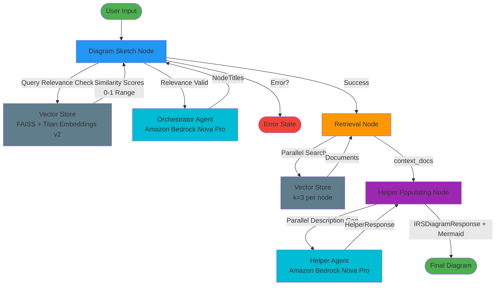

# Diagram Maker - Production-Ready AWS Deployment

A production-ready application demonstrating **deployable code architecture** with comprehensive AWS infrastructure considerations. This project emphasizes infrastructure as code, deployment patterns, and cloud-native design principles over AI capabilities.

## Core Philosophy

**The main idea of this project is not the AI—it's about building deployable code with deployment to AWS considerations.** Every component is designed with production deployment, scalability, and maintainability in mind.

## Architecture & Infrastructure

### High-Level Infrastructure

The system follows a cloud-native architecture designed for AWS deployment:

- **Edge Layer**: CloudFront CDN and API Gateway for request routing
- **Application Layer**: EC2-based services with RAG and agentic capabilities
- **Data Layer**: S3 buckets for frontend hosting and knowledge base storage
- **Database**: RDS (PostgreSQL/MySQL) for application data
- **Knowledge Access**: Amazon Bedrock Knowledge Bases for vector search

#### High-Level Architecture Diagram


### Infrastructure as Code

All AWS resources are defined using **Terraform modules** following best practices:

- **Modular Design**: Reusable Terraform modules for each infrastructure component
- **Environment-Aware**: Supports multiple environments (dev, staging, prod) via variables
- **Resource Configuration**: Each AWS resource properly configured with versioning, encryption, lifecycle rules, and access controls
- **IAM Roles**: Secure IAM roles with least-privilege policies for EC2 instances
- **Security Hardening**: EC2 instances configured with encryption, monitoring, and IMDSv2 enforcement

**Terraform Workflow Documentation**: [`Docs/terraform_mmd/terraform_workflow.md`](Docs/terraform_mmd/terraform_workflow.md)

**EC2 and IAM Setup Documentation**: [`Docs/ec2_iam_setup.md`](Docs/ec2_iam_setup.md)

### S3 Bucket Architecture

The project implements a **two-bucket strategy**:

- **Frontend Bucket**: Static website hosting with CloudFront integration
- **Knowledge Base Bucket**: Document storage with prefix-based organization:
  - `uploads/` - Initial document uploads
  - `corpus/` - Processed documents ready for indexing
  - `archive/` - Lifecycle-managed archived documents

Both buckets include:
- Server-side encryption (SSE)
- Versioning
- Lifecycle policies
- Proper IAM access controls

### EC2 Instance and IAM Roles

The application runs on EC2 instances with secure IAM roles providing access to AWS services:

**EC2 Instance Configuration:**
- **AMI**: Ubuntu 22.04 LTS (Jammy)
- **Instance Type**: Configurable (default: `t2.medium`)
- **Security Features**:
  - IAM instance profile attached (no hardcoded credentials)
  - Detailed CloudWatch monitoring enabled
  - EBS optimization enabled
  - IMDSv2 enforced (IMDSv1 disabled)
  - EBS root volume encryption enabled

**IAM Roles and Policies:**
- **Bedrock Policy**: Access to Amazon Titan Embeddings v2 and Nova LLM models
  - Titan Embeddings v2 (`amazon.titan-embed-text-v2:0`) - 1024-dimensional embeddings
  - Nova Lite (`amazon.nova-lite-v1:0`) - Lightweight LLM
  - Nova Pro (`amazon.nova-pro-v1:0`) - Advanced LLM
- **S3 Policy**: Access to knowledge base bucket (GetObject, PutObject, DeleteObject, ListBucket)
- **CloudWatch Logs Policy**: Full access for application logging

**Key Benefits:**
- No AWS credentials stored on instances
- Least-privilege access patterns
- Automatic credential rotation
- Secure metadata service access

**Documentation**: [`Docs/ec2_iam_setup.md`](Docs/ec2_iam_setup.md)

### RAG Pipeline and Embeddings

The application uses **Amazon Titan Embeddings v2** for vector-based document retrieval:

**Embedding Model:**
- **Model**: Amazon Titan Embeddings v2 (`amazon.titan-embed-text-v2:0`)
- **Dimensions**: 1024-dimensional vectors
- **Multilingual Support**: Supports multiple languages including Arabic
- **Cloud-Based**: No local model files, reducing Docker image size and deployment complexity

**Key Benefits:**
- **Reduced Image Size**: No need for large ML libraries (PyTorch, transformers) in Docker image
- **Scalability**: Cloud-based embeddings scale automatically with demand
- **Performance**: Optimized for production workloads with low latency
- **Cost Efficiency**: Pay-per-use pricing model
- **Maintenance**: AWS manages model updates and optimizations

**Chunking Strategy:**
- **Target Chunk Size**: 4000 tokens
- **Minimum Chunk Size**: 2048 tokens (chunks below this are merged)
- **Overlap**: 300 tokens between chunks
- **Optimization**: Chunking strategy optimized for Titan v2's 1024-dimensional embeddings

**Vector Store:**
- **Storage**: FAISS (Facebook AI Similarity Search) index
- **Embeddings**: Pre-computed using Titan v2 via parallel API calls
- **Persistence**: Vector store saved to disk for fast reloading
- **Search**: Similarity search with normalized scores (0-1 range)

**Performance Optimizations:**
- **Parallel Embedding**: Batch processing with concurrent API calls using ThreadPoolExecutor
- **Progress Tracking**: tqdm progress bars for long-running operations
- **Batch Processing**: Configurable batch sizes for optimal throughput

### Singleton Pattern for Vector Store

The vector store implementation uses a **singleton pattern with lazy initialization** to balance global access with testability:

**Documentation**: [`Docs/vector_store_singleton_pattern.md`](Docs/vector_store_singleton_pattern.md)

Key benefits:
- Single instance ensures consistency across the application
- Lazy initialization reduces startup overhead
- Testable through explicit reset functions
- Flexible for custom configurations when needed

```python
from src.core.pipeline.vector_store import vector_store

# Direct usage - singleton instance
results = await vector_store.search("query", k=10)
```

### Separation of Concerns: Vector Store and Retrieval

The codebase follows a clean separation between storage management and search functionality:

- **Vector Store** (`src/core/pipeline/vector_store.py`): Handles document storage, embedding generation using Amazon Titan Embeddings v2, and FAISS index management
- **Retrieval Service** (`src/core/pipeline/retrieval.py`): Handles search operations and query processing with similarity score normalization

This separation provides:
- Clear responsibility boundaries
- Easier testing and mocking
- Flexible search implementations
- Better code organization

**Embedding Generation:**
- Uses `BedrockEmbeddings` from LangChain AWS integration
- Parallel batch processing for efficient embedding generation
- Automatic retry and error handling
- Progress tracking with tqdm

```python
from src.core.pipeline.vector_store import get_vector_store
from src.core.pipeline.retrieval import Retriever

# Initialize vector store with Titan Embeddings v2
vector_store = get_vector_store()
vector_store.add_documents(documents)

# Use retriever for search operations
retriever = Retriever(vector_store.vector_store)
results = await retriever.search("query", k=10)
results_with_scores = await retriever.search_with_scores("query", k=10)
```

## Agentic System Architecture

The diagram generation system is built using **LangGraph**, a framework for building stateful, multi-agent applications. The system orchestrates three main nodes that work together to transform user queries into structured diagrams.

### LangGraph Workflow Overview



### Node Architecture and Data Flow

```mermaid
flowchart LR
    subgraph GraphState["GraphState (Pydantic BaseModel)"]
        UserInput[user_input: str]
        DiagramSkeleton[diagram_skeleton: NodeTitles]
        ContextDocs["context_docs: Dict(str, List(Document))"]
        FinalDiagram[final_diagram: IRSDiagramResponse]
        MermaidDiagram[mermaid_diagram: str]
        ErrorMsg[error_message: str]
    end

    subgraph Node1["1. Diagram Sketch Node"]
        RelevanceCheck[Relevance Check<br/>Max Score vs Threshold]
        OrchestratorCall[Invoke Orchestrator Agent]
        NodeTitlesOut[Output: NodeTitles]
    end

    subgraph Node2["2. Retrieval Node"]
        ParallelSearch[Parallel Search<br/>asyncio.gather]
        SearchTask1[Search Task 1<br/>title → docs]
        SearchTask2[Search Task 2<br/>title → docs]
        SearchTaskN[Search Task N<br/>title → docs]
        ContextDict["Build context_docs<br/>Dict(title: List(Document))"]
    end

    subgraph Node3["3. Helper Populating Node"]
        ParallelPopulate[Parallel Population<br/>asyncio.gather]
        PopulateTask1[Populate Task 1<br/>node + docs → description]
        PopulateTask2[Populate Task 2<br/>node + docs → description]
        PopulateTaskN[Populate Task N<br/>node + docs → description]
        BuildNodes[Build Nodes Object<br/>id, title, hierarchy, description]
        BuildEdges[Build Edges Object<br/>from parent & children]
        BuildDiagram[Build IRSDiagramResponse]
        MermaidParser[Parse to Mermaid<br/>Flowchart Syntax]
    end

    UserInput --> Node1
    Node1 --> RelevanceCheck
    RelevanceCheck -->|Pass| OrchestratorCall
    OrchestratorCall --> NodeTitlesOut
    NodeTitlesOut --> DiagramSkeleton

    DiagramSkeleton --> Node2
    Node2 --> ParallelSearch
    ParallelSearch --> SearchTask1
    ParallelSearch --> SearchTask2
    ParallelSearch --> SearchTaskN
    SearchTask1 --> ContextDict
    SearchTask2 --> ContextDict
    SearchTaskN --> ContextDict
    ContextDict --> ContextDocs

    DiagramSkeleton --> Node3
    ContextDocs --> Node3
    Node3 --> ParallelPopulate
    ParallelPopulate --> PopulateTask1
    ParallelPopulate --> PopulateTask2
    ParallelPopulate --> PopulateTaskN
    PopulateTask1 --> BuildNodes
    PopulateTask2 --> BuildNodes
    PopulateTaskN --> BuildNodes
    DiagramSkeleton --> BuildEdges
    BuildNodes --> BuildDiagram
    BuildEdges --> BuildDiagram
    BuildDiagram --> MermaidParser
    BuildDiagram --> FinalDiagram
    MermaidParser --> MermaidDiagram

    style GraphState fill:#E3F2FD
    style Node1 fill:#BBDEFB
    style Node2 fill:#FFE0B2
    style Node3 fill:#E1BEE7
```



### State Transition Diagram


### Parallel Execution Patterns


### Node Details

#### 1. Diagram Sketch Node

**Purpose**: Validates query relevance and generates the initial diagram skeleton.

**Key Features**:
- **Relevance Validation**: Checks similarity scores (normalized to 0-1 range) against threshold
- **Orchestrator Agent**: Uses Amazon Bedrock Nova Pro to generate hierarchical node structure
- **Error Handling**: Returns error if query is not relevant or skeleton generation fails

**Input**: `user_input: str`
**Output**: `diagram_skeleton: NodeTitles` or `error_message: str`


#### 2. Retrieval Node

**Purpose**: Retrieves relevant documents for each node title in parallel.

**Key Features**:
- **Parallel Execution**: Uses `asyncio.gather` for concurrent searches
- **Top-K Retrieval**: Retrieves k=3 documents per node title
- **Context Mapping**: Maps each node title to its retrieved documents

**Input**: `diagram_skeleton: NodeTitles`
**Output**: `context_docs: Dict[str, List[Document]]` or `error_message: str`


#### 3. Helper Populating Node

**Purpose**: Generates descriptions for all nodes and constructs the final diagram.

**Key Features**:
- **Parallel Description Generation**: Uses thread pool executor for true parallelism
- **Helper Agent Integration**: Calls helper agent for each node with its context documents
- **Diagram Construction**: Builds `Nodes`, `Edges`, and `IRSDiagramResponse` objects
- **Edge Building**: Creates edges from both `parent_node_id` and `children_node_ids` relationships
- **Automatic Mermaid Generation**: Automatically converts `IRSDiagramResponse` to Mermaid flowchart syntax
- **Automatic File Saving**: Saves Mermaid diagrams to `.mmd` files in the `Docs/` directory

**Input**: `diagram_skeleton: NodeTitles`, `context_docs: Dict[str, List[Document]]`, `user_input: str`
**Output**: `final_diagram: IRSDiagramResponse`, `mermaid_diagram: str`, `mermaid_filepath: str`, or `error_message: str`


### Data Models


### Routing Logic


### Mermaid Parsing Module

The system includes an automatic Mermaid diagram generation module that converts structured diagram data into Mermaid flowchart syntax for visualization.

#### Module Location
`src/core/agentic_system/nodes/mermaid_parsing/`

#### Key Features

1. **Hierarchy Visualization**: Different node shapes based on hierarchy level:
   - **Level 0 (Root)**: Rectangles `[text]`
   - **Level 1**: Rounded rectangles `(text)`
   - **Level 2**: Stadium shapes `([text])`
   - **Level 3+**: Cylinders `[(text)]`

2. **Node Label Formatting**: 
   - Node titles and descriptions are combined in the node box
   - Descriptions are included using `<br/>` separator
   - Special characters (parentheses, brackets, etc.) are automatically escaped
   - Labels with special characters are wrapped in quotes for Mermaid compatibility
   - Node IDs are sanitized to be Mermaid-safe

3. **Automatic File Saving**:
   - Mermaid diagrams are automatically saved to `.mmd` files in the `Docs/` directory
   - Filenames are generated from diagram titles (sanitized) or timestamps
   - File path is stored in `GraphState.mermaid_filepath` for reference

4. **Automatic Integration**:
   - Mermaid parsing is automatically called after `final_diagram` is created
   - The Mermaid syntax is stored in `GraphState.mermaid_diagram`
   - Files are automatically saved after successful parsing
   - Errors are handled gracefully (logs warning if parsing or saving fails)

#### Module Structure

- **`flowchart_parser.py`**:
  - Main parsing function `parse_to_flowchart()` that converts `IRSDiagramResponse` to Mermaid syntax
  - `save_mermaid_to_file()` function that saves Mermaid code to `.mmd` files
- **`node_formatter.py`**:
  - Utilities for sanitizing node IDs and formatting labels
  - `escape_mermaid_text()` for escaping special characters
  - `needs_quotes()` for detecting labels that require quoting
  - `format_node_label()` returns formatted label and quote requirement flag
- **`hierarchy_builder.py`**: Functions for grouping nodes by hierarchy level and building relationships

#### Usage

```python
from src.core.agentic_system.nodes.mermaid_parsing import parse_to_flowchart, save_mermaid_to_file

# Automatically called in helper_populating_node
mermaid_diagram = parse_to_flowchart(final_diagram)
# Returns: "flowchart TD\n    Node1[Title<br/>Description] --> Node2(...)"

# Save to file (also automatically called in helper_populating_node)
filepath = save_mermaid_to_file(mermaid_diagram, diagram_title="My Diagram")
# Saves to: Docs/My_Diagram.mmd
# Returns: "Docs/My_Diagram.mmd"
```

**Automatic Workflow**: The `helper_populating_node` automatically:
1. Generates Mermaid syntax from `IRSDiagramResponse`
2. Saves the diagram to a `.mmd` file in the `Docs/` directory
3. Stores both the Mermaid syntax and file path in `GraphState`

### Key Implementation Details

1. **State Management**: LangGraph outputs dictionaries even when initialized with Pydantic BaseModel. All nodes handle both dict and object access patterns.

2. **Embedding Model**: The application uses Amazon Titan Embeddings v2 (`amazon.titan-embed-text-v2:0`) for all vector operations:
   - 1024-dimensional embeddings optimized for production workloads
   - Cloud-based API calls via AWS Bedrock (no local model files)
   - Parallel batch processing with ThreadPoolExecutor for efficient embedding generation
   - Automatic retry and error handling for robust operation

3. **Parallel Execution**:
   - Retrieval node uses `asyncio.gather` for parallel document searches
   - Helper populating node uses `loop.run_in_executor` for parallel agent calls
   - Embedding generation uses ThreadPoolExecutor for concurrent API calls

4. **Error Handling**: Each node returns `error_message` in state, and routing functions check for errors before proceeding.

5. **Agent Response Extraction**: Both orchestrator and helper agents extract `structured_response` from the agent's dictionary output (which contains both `messages` and `structured_response`).

6. **Similarity Score Normalization**: FAISS distance scores are normalized to 0-1 similarity range using `1.0 / (1.0 + distance)`. This normalization works with Titan v2's 1024-dimensional embeddings.

7. **Chunking Strategy**: Documents are chunked with a minimum of 2048 tokens per chunk, optimized for Titan v2's embedding capabilities. Smaller chunks are automatically merged to meet the minimum requirement.

8. **Mermaid Diagram Generation**: The `helper_populating_node` automatically generates Mermaid flowchart syntax from `IRSDiagramResponse`, using different node shapes based on hierarchy levels and including descriptions in node labels. The diagram is automatically saved to a `.mmd` file in the `Docs/` directory with the file path stored in `GraphState.mermaid_filepath`.

9. **Special Character Handling**: Labels containing parentheses, brackets, or other special characters are automatically wrapped in quotes to prevent Mermaid parsing errors. This ensures valid syntax even when node titles or descriptions contain characters like `(NF4)`, `[text]`, etc.

## Project Structure

```
diagram_maker/
├── terraform/              # Infrastructure as Code
│   ├── modules/           # Reusable Terraform modules
│   │   ├── s3_frontend/  # Frontend hosting module
│   │   ├── s3_kb/        # Knowledge base storage module
│   │   ├── app_instance/ # EC2 instance with IAM roles
│   │   └── ecr/          # ECR repository module
│   ├── main.tf           # Root module definitions
│   └── variables.tf      # Environment variables
├── src/                   # Application code
│   ├── api/              # FastAPI endpoints
│   ├── boundary/         # Data access layer
│   ├── core/             # Business logic
│   │   ├── pipeline/     # RAG pipeline components
│   │   │   ├── vector_store.py  # Vector store management
│   │   │   └── retrieval.py    # Search/retrieval service
│   │   └── agentic_system/
│   │       └── nodes/
│   │           └── mermaid_parsing/  # Mermaid diagram generation
│   ├── services/         # Service layer
│   └── configs/          # Configuration management
├── Docs/                  # Architecture and deployment documentation
│   ├── arch_mmd/         # Architecture diagrams
│   ├── terraform_mmd/    # Terraform workflow diagrams
│   ├── ec2_iam_setup.md  # EC2 and IAM roles documentation
│   └── vector_store_singleton_pattern.md
├── DOCKER_RUN.md         # Docker deployment guide
└── tests/                 # Comprehensive test suite
```

## Deployment Considerations

### Environment Configuration

- **Multi-Environment Support**: Terraform variables enable deployment to dev, staging, and production
- **Configuration Management**: Centralized configs with environment-specific overrides
- **Secrets Management**: AWS Secrets Manager integration ready

### Scalability

- **Stateless Application Design**: Enables horizontal scaling
- **Cloud-Based Embeddings**: Amazon Titan Embeddings v2 scales automatically with demand, no local resource constraints
- **S3 Lifecycle Policies**: Automatic archival and expiration
- **Database Connection Pooling**: Optimized for concurrent requests
- **CDN Integration**: CloudFront for global content delivery
- **Parallel Processing**: Embedding generation and retrieval operations use parallel processing for optimal throughput

### Security

- **IAM Roles**: Least-privilege access patterns with instance profiles
  - EC2 instances use IAM roles instead of access keys
  - Bedrock access limited to specific model ARNs (Titan Embeddings v2, Nova Lite/Pro)
  - S3 access scoped to knowledge base bucket only
  - CloudWatch logs access for monitoring
- **EC2 Security Hardening**:
  - IMDSv2 enforcement (prevents SSRF attacks)
  - EBS volume encryption at rest
  - Detailed monitoring enabled
  - EBS optimization for performance
- **Encryption**: At-rest and in-transit encryption
- **VPC Endpoints**: Private network access to AWS services (ready for implementation)
- **WAF Integration**: Web application firewall ready

### Observability

- **CloudWatch Integration**: Metrics and logging
- **X-Ray Tracing**: Distributed tracing support
- **Health Checks**: Application and infrastructure monitoring

## Getting Started

### Prerequisites

- Python 3.12+
- Terraform >= 1.0
- AWS CLI configured
- AWS account with appropriate permissions

### Local Development

```bash
# Install dependencies
uv sync

# Run application
python main.py

# Run tests
pytest
```

### Infrastructure Deployment

```bash
cd terraform

# Initialize Terraform
terraform init

# Plan deployment
terraform plan -var="environment=dev"

# Apply infrastructure
terraform apply -var="environment=dev"

# View outputs (includes EC2 instance details and IAM role ARNs)
terraform output
```

**Infrastructure Modules Deployed:**
- S3 Frontend Bucket (static website hosting)
- S3 Knowledge Base Bucket (document storage)
- ECR Repository (Docker image storage)
- EC2 Instance with IAM Roles (application hosting)

**EC2 Instance Outputs:**
- Instance ID and IP addresses (public/private)
- IAM role ARN and instance profile name
- Use these outputs to configure your application or connect to the instance

## Testing Strategy

- **Unit Tests**: Core business logic and utilities
- **Integration Tests**: Service integration and data pipeline
- **E2E Tests**: API endpoint validation
- **Benchmark Tests**: Performance and load testing

## Documentation

All deployment and architecture documentation is located in the [`Docs/`](Docs/) directory:

- **Architecture Diagrams**: Mermaid diagrams for infrastructure design
- **Terraform Workflows**: Step-by-step module creation and usage
- **EC2 and IAM Setup**: Comprehensive guide for EC2 instance and IAM roles configuration
- **Code Patterns**: Design patterns and best practices
- **Docker Deployment**: Guide for building and running Docker containers

## Key Design Principles

1. **Infrastructure as Code First**: All AWS resources defined in Terraform
2. **Modularity**: Reusable, composable modules
3. **Environment Parity**: Same code, different configurations
4. **Testability**: Code designed for easy testing and mocking
5. **Observability**: Built-in logging, metrics, and tracing
6. **Security by Default**: Encryption, IAM, and access controls
7. **Scalability**: Stateless design and horizontal scaling support


# diagram_maker
